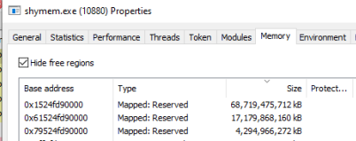
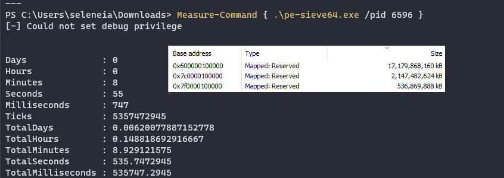
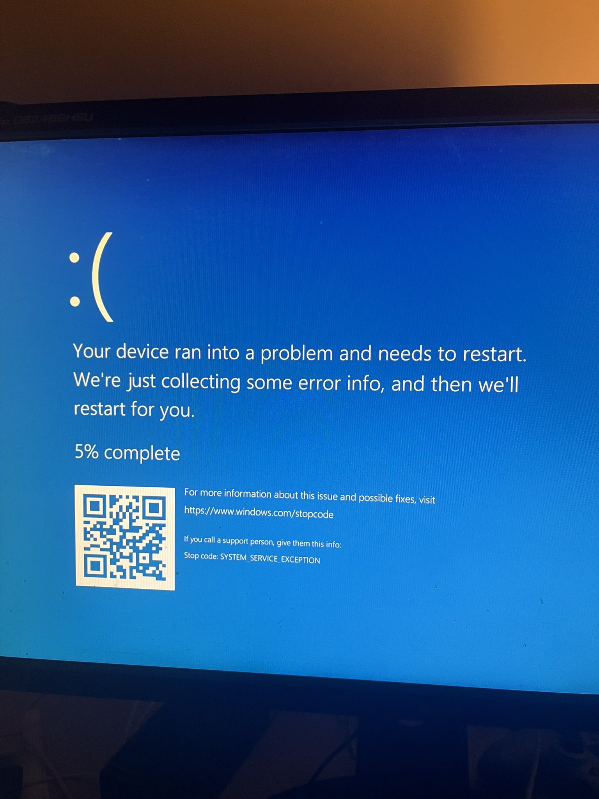

# shymem

Hinders scanning of your process's memory by creating huge section views that slow down memory scanners. Based on this [secret.club article](https://secret.club/2021/05/23/big-memory.html) with the addition of using transacted files instead of existing ones.

The maximum size of the created views depends on how much ram is on your system and how many times you manage to call `NtMapViewOfSection`, here it is tested on a system with 64gigs of ram.

Here's how long a pesieve scan takes on my system with 16gigs of ram

## WARNING

can cause BSODs although i have not managed to figure out how and why it happens since it has only happened once.

